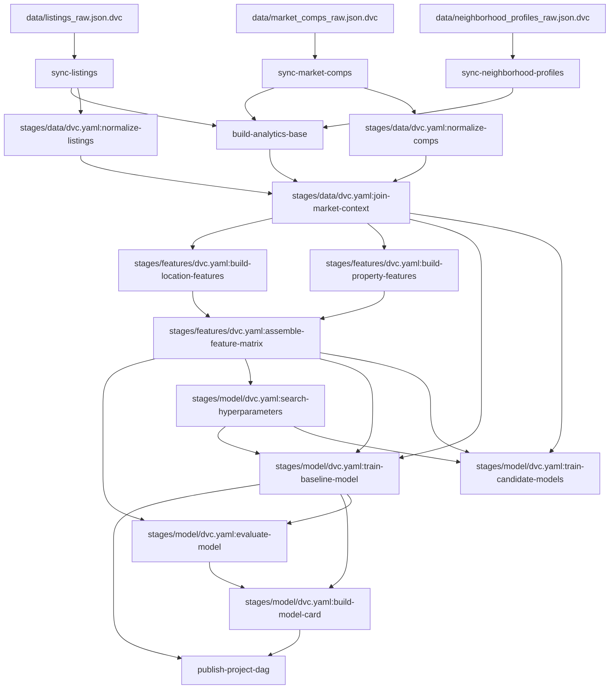

# dvc-dag

Generate a readable PNG diagram of your DVC pipeline.

[](https://pypi.python.org/pypi/dvc-dag)
[](https://github.com/AndreaVidali/dvc-dag/blob/main/LICENSE)
[](https://pypi.python.org/pypi/dvc-dag)
[](https://github.com/AndreaVidali/dvc-dag/actions)

<div align="center">
<br>

</div>

<br>
From this (`dvc dag --collapse-foreach-matrix --md`):
<br><br>



## Overview

The bundled `dvc dag` command is useful, but larger pipelines quickly become hard to read.

`dvc-dag` renders the pipeline as a PNG and applies a few readability
improvements:

- trims transitive edges
- collapses parameterized stages when requested
- simplifies displayed paths
- uses colors and shapes to distinguish nodes

## Requirements

`dvc-dag` supports Python 3.10 and newer.

`dvc-dag` must be run inside a Git repository initialized with DVC.

It also requires Graphviz on your `PATH`, specifically the `dot` and `tred`
executables.

Install Graphviz with your system package manager:

- macOS: `brew install graphviz`
- Debian/Ubuntu: `sudo apt-get install graphviz`
- Windows: install Graphviz from <https://graphviz.org/download/>

## Installation

Install the package from PyPI:

```bash
pip install dvc-dag
```

Or install it as an isolated CLI:

```bash
pipx install dvc-dag
```

## Usage

Generate a PNG in the current DVC repository:

```bash
dvc-dag
```

Show all options:

```bash
dvc-dag --help
```

Show the installed version:

```bash
dvc-dag --version
```

Collapse parameterized stages:

```bash
dvc-dag --collapse-stage "train-candidate-models=family"
```

The `--collapse-stage` format is:

```text
stage_name=parameter_name
path/to/dvc.yaml:stage_name=parameter_name
```

### CLI Options

- `--out PATH`
  Write the generated PNG to `PATH`. Parent directories are created automatically. Default: `dvc_dag.png`.
- `--delete-text TEXT`
  Remove repeated path fragments from displayed node labels to keep the graph readable. Pass it multiple times to strip more than one fragment.
- `--collapse-stage RULE`
  Collapse a parametrized stage into a single node. Use `stage_name=parameter_name` or `path/to/dvc.yaml:stage_name=parameter_name`. The collapsed label is rendered as `stage_name@{parameter_name}`.
- `--colors-random-seed INTEGER`
  Control the color assignment for graph nodes. Use the same seed to keep colors stable across runs. Default: `42`.
- `--debug`
  Show full tracebacks instead of the default concise runtime errors.
- `--version`
  Print the installed `dvc-dag` version and exit.
- `--help`
  Show the full command help generated by Typer.

Typical example:

```bash
dvc-dag \
  --out docs/dvc_dag.png \
  --delete-text "pipelines/" \
  --delete-text "stages/" \
  --collapse-stage "train-candidate-models=family"
```

## Troubleshooting

- `DVC was not found`: install `dvc` and ensure it is on your `PATH`.
- `Not inside a DVC repository`: run `dvc init` in the project first.
- `Graphviz dot/tred was not found`: install Graphviz and ensure both tools are on your `PATH`.

## Development

The repository includes a committed DVC fixture project under `tests/fixtures/`
for end-to-end testing.

The release workflow is documented in [`docs/releasing.md`](docs/releasing.md).

You can try the CLI manually against the committed fixture project:

```bash
cd tests/fixtures/dvc_project
uv run dvc-dag --out /tmp/dvc_project_dag.png
```

Or render the fixture DAG straight from the repository root:

```bash
make dag
```

`make dag` is the supported way to refresh the demo DAG. It regenerates the
fixture image and then syncs `docs/dvc_project_dag.png` for the README.
